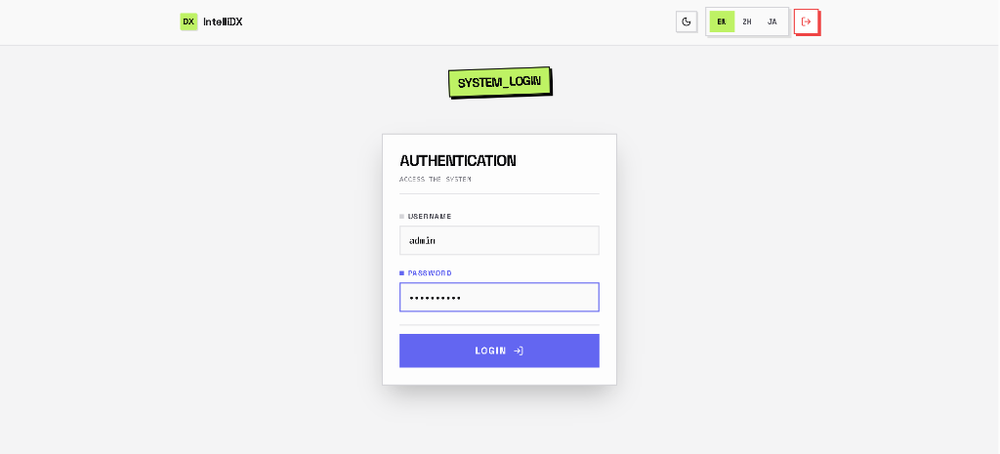
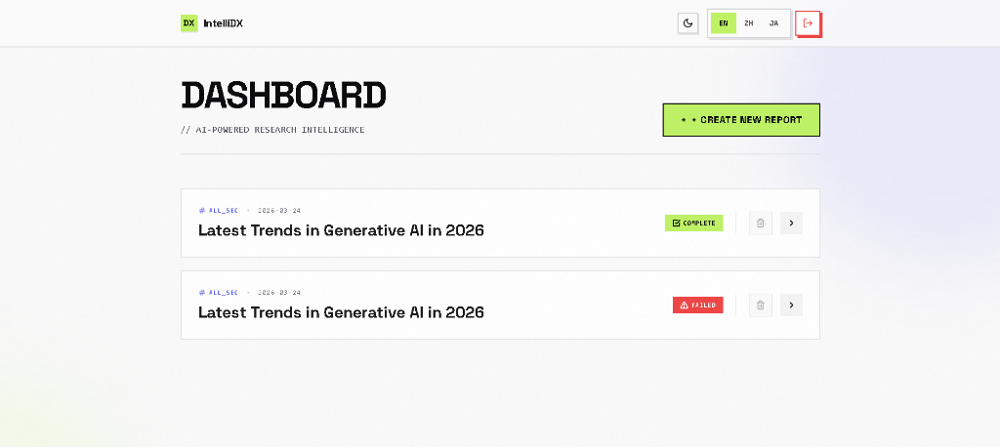
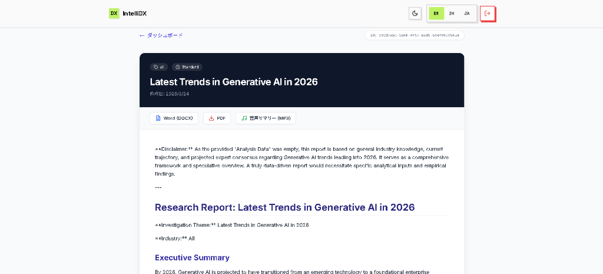

# IntelliDX

[English](README.md) | [中文](README_CN.md) | [日本語](README_JP.md)

助力企业数字化转型（DX）的产业特化型 AI 调研与报告自动生成引擎。

## 项目概述
IntelliDX 旨在帮助企业 DX 推进部门自动化处理重复且耗时的“调研、分析与报告撰写”任务。
**“将原本需要 3 天的竞品分析、市场调研和技术选定报告编写工作，压缩至 3 分钟内完成。”**

## 核心功能
- **多智能体调研 (Multi-Agent)**：基于 LangGraph 架构，协同规划者、研究者、分析师与撰写官等专业 AI 节点。
- **鲁棒性引擎 (Robustness Engine)**：内置防止无限循环和 API 频率限制的保护机制。
- **新粗野主义 UI (Neo-Brutalist)**：独特、高对比度的专业设计风格，摒弃平庸的 AI 审美。
- **多格式导出**：支持生成专业的 DOCX、PDF 报告以及 SWOT 分析图表。
- **国际化支持 (i18n)**：原生支持中文、日文和英文切换。

## 界面展示

| 登录页面 | 控制台 | 报告分析 |
| :---: | :---: | :---: |
|  |  |  |

## 技术栈
- **前端 (Frontend)**: Next.js 14 (App Router) + TailwindCSS
- **后端 API (Backend)**: FastAPI (Python 3.11)
- **任务队列 (Worker)**: Celery + Redis
- **数据库 (Database)**: PostgreSQL
- **AI 引擎 (AI Engine)**: LangGraph + Google Gemini 2.5/3.1

### 代理鲁棒性与错误处理
为确保系统在外部 API 故障时仍能保持稳定：
- **循环次数限制**：研究阶段上限为 3 次迭代。如果搜索结果不足，系统将优雅退出而非无限循环。
- **API 额度检测**：优化了日志记录，可识别具体错误（如 Serper 400 "额度不足"）。
- **频率限制退避**：在研究任务之间自动延迟，以满足 NewsAPI 的 429 限制。

## 快速入门

### 1. 环境配置
在项目根目录下创建 `.env` 文件：

```ini
GEMINI_API_KEY=your_gemini_api_key
SERPER_API_KEY=your_serper_api_key
NEWS_API_KEY=your_news_api_key
GCS_BUCKET=your_gcs_bucket_name
```

### 2. 使用 Docker Compose 启动
```bash
docker-compose up --build
```

### 3. 访问链接
- **前端界面**: http://localhost:8080 (通过 Nginx 代理)
- **后端接口**: http://localhost:8080/api/
- **交互式文档**: http://localhost:8080/api/docs

## 许可证
MIT License
